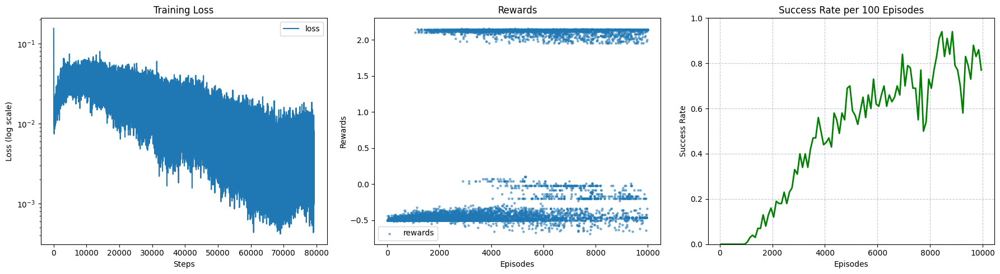

# A semi-stable implementation of a reinforcement learning maze solver

This is a repo for the code **RL maze solver agent** used in the talk "Reinforcement Learning" for the seminar: Scientific Machine Learning @Universität Heidelberg

Which contains:

- [mazegen.py](./mazegen.py): A script to generate a checkerboard like maze translated from the frontend js code from [featurecrew maze gen](https://featurecrew.io/tests/maze)
- [maze_RL_semistable.ipynb](./maze_RL_semistable.ipynb): The simple Deep Q-Learning Network(DQN) implementation with reward function, action function, learning from experience, calculating TD target, etc. with two 2-hidden layer simple Q neutral network.

One sample training run:

here:
- reward around 2: agent successfully solved a 5x5 maze
- reward around 0: agent got stuck in some loop(some may also have reached goal)
- reward negative: agent hit the maze wall

Other than the original maze generation code featurecrew, this content of this repo is shared under MIT license.
